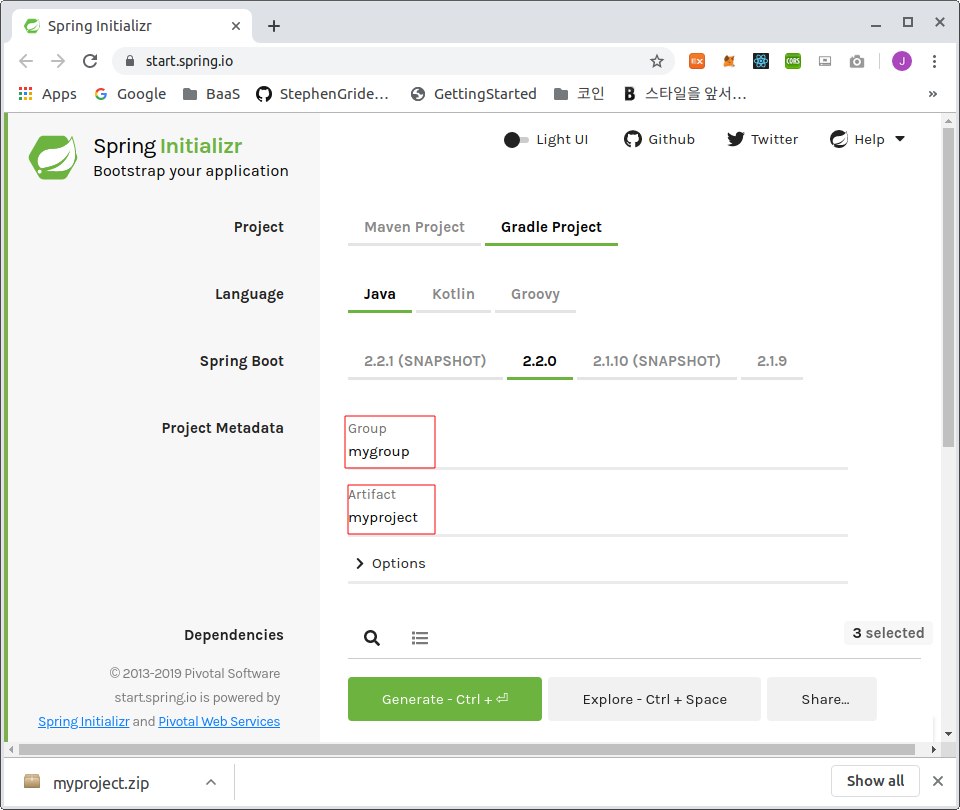

# JPA를 사용한 Springboot 프로젝트 만들기

## 프로젝트 환경설정

- [Spring Initializr](#spring-initializr)

### Java 1.8

[Donwload site](https://www.oracle.com/technetwork/java/javase/downloads/jre8-downloads-2133155.html)에서 OS별로 download 가능

### Intellij

Java 개발시 아주 좋은 IDE이며 [Download page](https://www.jetbrains.com/idea/download/)에서 OS별로 설치 가능

### Spring Initializr

[Spring Initializr](https://start.spring.io/)는 스프링에서 제공하는 프로젝트 생성을 간편하게 해주는 도구이다.

사이트에 접속해서 아래와 같이 설정한다.



Dependencies 에는 아래 목록들을 검색하여 추가한다.

- Spring Web
- Thymeleaf
- Spring Data JPA
- H2 Database
- Lombook

Generate 버튼을 클릭하여 프로젝트를 다운로드 한다.

다운로드 한 프로젝트를 적당한 위치에 두고 intellij에서 압축을 해재한 프로젝트를 import 한다. (build.gradle 파일을 오픈)

## 개발

### package 구조

```plain
.
├── main
│   ├── java
│   │   └── jpabook
│   │       └── jpashop
│   │           ├── domain
│   │           │   └── item
│   │           ├── exception
│   │           ├── repository
│   │           └── service
│   └── resources
│       ├── static
│       └── templates
└── test
    ├── java
    │   └── jpabook
    │       └── jpashop
    │           ├── doamin
    │           └── service
    └── resources
```


